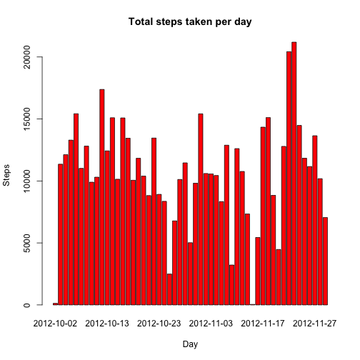
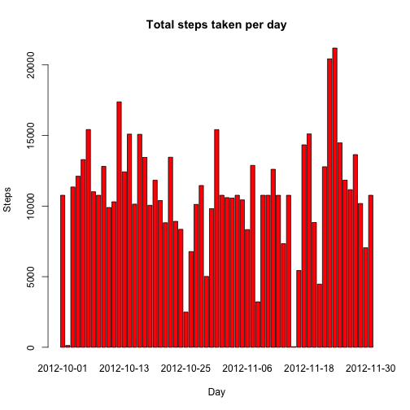

# Reproducible Research: Peer Assessment 1


## Loading and preprocessing the data

First, we load the data:


```r
data <- read.table("activity.csv", header=TRUE, sep=",")
str(data)
```

```
## 'data.frame':	17568 obs. of  3 variables:
##  $ steps   : int  NA NA NA NA NA NA NA NA NA NA ...
##  $ date    : Factor w/ 61 levels "2012-10-01","2012-10-02",..: 1 1 1 1 1 1 1 1 1 1 ...
##  $ interval: int  0 5 10 15 20 25 30 35 40 45 ...
```

Then, we convert the date variable to date type:


```r
data <- transform(data, date = as.Date(date))
str(data)
```

```
## 'data.frame':	17568 obs. of  3 variables:
##  $ steps   : int  NA NA NA NA NA NA NA NA NA NA ...
##  $ date    : Date, format: "2012-10-01" "2012-10-01" ...
##  $ interval: int  0 5 10 15 20 25 30 35 40 45 ...
```

```r
head(data)
```

```
##   steps       date interval
## 1    NA 2012-10-01        0
## 2    NA 2012-10-01        5
## 3    NA 2012-10-01       10
## 4    NA 2012-10-01       15
## 5    NA 2012-10-01       20
## 6    NA 2012-10-01       25
```


## What is mean total number of steps taken per day?

First, we remove the missing values:


```r
completeCases <- data[complete.cases(data$steps),c("steps","date")]
```

Then, we calculate the number of steps taken per day and rename the columns:


```r
stepsPerDay <- aggregate(completeCases$steps, by=list(completeCases$date), FUN=sum)
names(stepsPerDay) <- c("date", "steps")
```

Then, we make a histogram of the total number of steps taken per day:


```r
barplot(
    stepsPerDay$steps, 
    names.arg=stepsPerDay$date,
    main="Total steps taken per day",
    xlab="Day",
    ylab="Steps",
    col="red")
```

 

An finally, we calculate the mean and the median total number of steps taken per day:


```r
meanSteps <- mean(stepsPerDay$steps)
medianSteps <- median(stepsPerDay$steps)
```

- The mean number of steps taken per day is **1.0766 &times; 10<sup>4</sup>**.
- The median number of steps taken per day is **10765**.


## What is the average daily activity pattern?

First, we remove the missing values:


```r
completeCases <- data[complete.cases(data$steps),]
```

Then, we calculate the average number of steps taken per interval and rename the columns:


```r
stepsPerInterval <- aggregate(
        completeCases[,c("steps")], 
        by=list(completeCases$interval), 
        FUN=mean)

names(stepsPerInterval) <- c("interval", "steps")
```

Then, we make a time series plot with the average daily activity: 


```r
plot(
    stepsPerInterval$interval, 
    stepsPerInterval$steps, 
    type="l",
    main="Average daily activity",
    xlab="5-minute interval",
    ylab="Average number of steps")
```

 

Finally, we calculate the 5-minute interval wich contains the maximum number of steps.


```r
IntervalMaxSteps <- stepsPerInterval[order(-stepsPerInterval$steps),][1,"interval"]
```

The interval **835** is the 5-minute interval wich contains the maximum number of steps.


## Imputing missing values

First, we calculate the total number of missing values in the dataset:


```r
totalMissing <- nrow(data[is.na(data),])
```

The total number of missing values in the dataset is **2304**.

Then, we are going to create a dataset with the missing values filled with the mean for that 5-minute interval:


```r
dataFilled <- data

for (i in 1:nrow(dataFilled))
{
    if(is.na(dataFilled$steps[i]))
    {
        interval <- stepsPerInterval$interval == dataFilled$interval[i]
        dataFilled$steps[i] = stepsPerInterval[interval, "steps"]
    }
}
```

Then, we calculate the number of steps taken per day and rename the columns:


```r
stepsPerDayFilled <- aggregate(
    dataFilled$steps, 
    by=list(dataFilled$date), 
    FUN=sum)

names(stepsPerDayFilled) <- c("date", "steps")
```

Then, we make a histogram of the total number of steps taken per day:


```r
barplot(
    stepsPerDayFilled$steps, 
    names.arg=stepsPerDayFilled$date,
    main="Total steps taken per day",
    xlab="Day",
    ylab="Steps",
    col="red")
```

 

An finally, we calculate the mean and the median total number of steps taken per day:


```r
meanStepsFilled <- mean(stepsPerDayFilled$steps)
medianStepsFilled <- median(stepsPerDayFilled$steps)
```

- The mean number of steps taken per day is **1.0766 &times; 10<sup>4</sup>**.
- The median number of steps taken per day is **1.0766 &times; 10<sup>4</sup>**.

If we compare this values with the values calculated in the first part, we can see that **the mean has the same value but the median has slightly increased**.


## Are there differences in activity patterns between weekdays and weekends?
